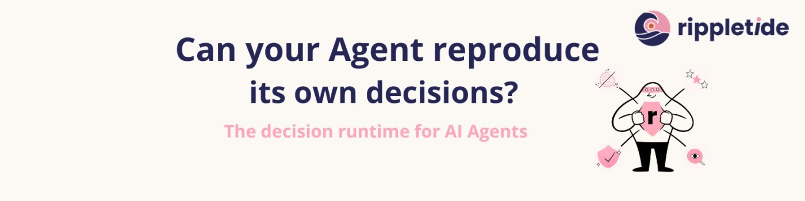

<p align="center">
  <strong>Rippletide adds an authority layer that validates, constrains, or blocks agent actions at runtime before they impact real systems or customers.</strong>
</p>

<p align="center">
  <a href="https://app.rippletide.com">Web Platform</a>
  ·
  <a href="https://github.com/rippletideco/rippletide">GitHub</a>
  ·
  <a href="https://docs.rippletide.com">Documentation</a>
  ·
  <a href="https://discord.gg/zUPTRH5eFv">Discord</a>
</p>

<p align="center">
  <a href="https://www.npmjs.com/package/rippletide"></a>
  <a href="https://www.npmjs.com/package/rippletide"></a>
  <a href="https://github.com/rippletideco/rippletide/stargazers"></a>
  <a href="https://github.com/rippletideco/rippletide/issues"></a>
  <a href="https://discord.gg/zUPTRH5eFv"></a>
</p>


<br />

This repository is your starting point for Rippletide — Context Graph MCP and Coding Agents.

---

## Table of Contents

- [What is Rippletide?](#what-is-rippletide)
- [Rippletide Platform](#rippletide-platform)

**Core Modules:**


| #   | Module                                      | What it does                                       |
| --- | ------------------------------------------- | -------------------------------------------------- |
| 1   | [Context Graph - MCP](#context-graph---mcp) | Give your agents persistent memory across sessions |
| 2   | [Coding Agents](#coding-agents)             | A persistent memory layer for Claude               |


<sub>**Decision Runtime** — Enterprise Only. Build deterministic agents with less than 1% hallucination rate. [Contact us](https://rippletide.com) to learn more.</sub>

---

## What is Rippletide?

Rippletide adds an authority layer that validates, constrains, or blocks agent actions at runtime before they impact real systems or customers.


|                    | Without Rippletide           | With Rippletide               |
| ------------------ | ---------------------------- | ----------------------------- |
| **Hallucinations** | Variable, hard to control    | Less than 1% by design        |
| **Memory**         | Lost between conversations   | Persistent context graph      |
| **Guardrails**     | Prompt-based, easy to bypass | Engine-level, 100% compliance |
| **Explainability** | Black box                    | Every decision is traceable   |
---

## Context Graph - MCP

A persistent memory layer for your AI agents. Connect any MCP-compatible client (Cursor, Claude Desktop, Claude Code) and your agent can remember facts, decisions, and context across sessions.

### Quick Start

Add this to your MCP client config:

```json
{
  "mcpServers": {
    "rippletide": {
      "type": "http",
      "url": "https://mcp.rippletide.com/mcp?agentId=your-agent-id"
    }
  }
}
```

Get your `agentId` from the [Rippletide platform](https://app.rippletide.com).

| Client | Config location |
|--------|----------------|
| Cursor | `~/.cursor/mcp.json` |
| Claude Desktop | MCP settings in the app |
| Claude Code | `.mcp.json` at project root |

→ [MCP docs](https://docs.rippletide.com/docs/mcp/overview)

---

## Coding Agents

Give Claude Code a shared, persistent memory. Store your team's conventions once — naming rules, architecture decisions, error handling policies — and every Claude session pulls from the same source automatically.

### Quick Start

```bash
npx rippletide-code
```

One command to authenticate, scan your repo, select rules, and install hooks. Every Claude Code session in this project will have access to your rules from that point on.

If you need to point the CLI at a specific coding-agent backend, set one base URL and the CLI will derive the related endpoints from it:

```bash
RIPPLETIDE_API_URL="https://coding-agent.up.railway.app" npx rippletide-code
```

### Setup Flow

The CLI now has two setup flows.

**Individual**

- Start the CLI and choose `1. Individual workspace`
- The CLI uses the standard Rippletide cloud login flow
- After login, rules sync with the individual workspace

**Enterprise**

- Point the CLI at a client-hosted coding-agent backend:

```bash
RIPPLETIDE_API_URL="https://company-coding-agent.internal" npx rippletide-code
```

- Start the CLI and choose `2. Enterprise backend`
- The CLI stores that backend as the active coding-agent backend for later runs
- The enterprise backend handles uploads, rule extraction, and Anthropic-backed processing

In practice:

- Individual = Rippletide cloud auth + cloud workspace
- Enterprise = company backend + enterprise-local coding-agent flow

For the maintainer release flow for the internal CLI channel, see [context-graph/CLI_RELEASE_FLOW.md](./context-graph/CLI_RELEASE_FLOW.md).

### Features

| Feature | What it does |
|---|---|
| **Rule enforcement** | Rules are injected into every prompt. Code that violates a rule is blocked before it hits the file. Claude auto-rewrites until it complies. |
| **Rule management** | Add, edit, or delete rules in natural language. No config files. Changes take effect immediately. |
| **Rule sharing** | Send your rule set to a colleague with `invite-rules <email>`. They type `receive-rules <otp>` and get a conflict report with new rules, duplicates, and contradictions. |
| **Planning** | `/plan` generates an implementation plan and reviews it against your rules. Violations are revised automatically until the plan passes. |
| **Team governance** | Create a team, push your rules, and have every engineer sync from the same source. Read-only mode lets engineers inherit standards without modifying them. |

### Commands

| Action | Command |
|---|---|
| Share rules | `invite-rules <email>` |
| Receive rules | `receive-rules <otp>` |
| Create team | `create-team <name>` |
| Join team | `join-team <name> [approver_email]` |
| Approve member | `approve-join <team> <otp> <email>` |
| Push to team | `push-rules <team>` |
| Sync from team | `sync-rules <team>` |
| Read-only connect | `npx rippletide-code --read-only` |

### Data privacy

Rippletide only relies on the context available inside your local Claude Code workflow — your current chat session and your `CLAUDE.md`. Your codebase is not centrally analyzed. Rippletide stores only the extracted rules, not project content.

→ [Coding Agents docs](https://docs.rippletide.com/docs/coding-agents/overview)

---

## Rippletide Platform

The [Rippletide Platform](https://app.rippletide.com) brings everything together. Build agents without writing code, connect your knowledge sources, set guardrails that the LLM cannot override, and see exactly how your agent reasons through every decision — all in one place.

- **Visual Agent Builder** — configure agents without code
- **Knowledge Connectors** — import from Amazon Bedrock, PDFs, or manual Q&A
- **Knowledge Visualization** — see your agent's full knowledge graph
- **Guardrail Configuration** — rules enforced at runtime, not in the prompt

---

## Repository Structure

Customer-facing documentation is maintained in [`docs/`](./docs) and published
at [docs.rippletide.com](https://docs.rippletide.com). This directory is the
canonical source. Mintlify must use `rippletideco/rippletide`, branch `main`,
with `docs` as the directory containing `docs.json`.

```
rippletide/
├── context-graph/          # Rust MCP server for coding agents
│   ├── src/                # Rust source
│   └── npm/                # Multi-platform binary packages
└── docs/                   # Documentation site (Mintlify)
```

---

## Development

```bash
git clone https://github.com/rippletideco/rippletide.git

# Context Graph MCP server
cd rippletide/context-graph
cargo build --release

```

---

## Contributing

We welcome contributions. Please read our [Contributing Guidelines](./CONTRIBUTING.md), [Code of Conduct](./CODE_OF_CONDUCT.md), and [Security Policy](./SECURITY.md) before opening a PR.

---

## Support

- **Discord**: [Join our community](https://discord.gg/zUPTRH5eFv)
- **GitHub Issues**: [Report bugs](https://github.com/rippletideco/rippletide/issues)
- **Docs**: [docs.rippletide.com](https://docs.rippletide.com)

---

Built with ❤️ by the [Rippletide](https://rippletide.com) team
