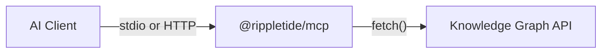

## What is the MCP Server?

The Rippletide MCP server connects AI clients (Cursor, Claude Desktop, Claude Code) to your agent's knowledge graph. It lets your AI assistant **remember**, **recall**, and **reason** over structured knowledge — across conversations.



The MCP server is a **thin client** with zero local state. Everything is persisted in Redis via the knowledge graph backend.

## Quick Start

<CodeGroup>

```bash npm
npx @rippletide/mcp --api-url http://localhost:3000 --agent-id your-agent-id
```

```bash global install
npm install -g @rippletide/mcp
rippletide-mcp --api-url http://localhost:3000 --agent-id your-agent-id
```

</CodeGroup>

The server starts on stdio and exposes **7 tools** and **4 resources** to your AI client.

## Setup

Add to your MCP client config:

```json
{
  "mcpServers": {
    "rippletide": {
      "command": "npx",
      "args": ["-y", "@rippletide/mcp"],
      "env": {
        "GRAPH_API_URL": "http://localhost:3000",
        "AGENT_ID": "your-agent-id"
      }
    }
  }
}
```

<CardGroup cols={3}>
  <Card title="Cursor" icon="code">
    Save to `~/.cursor/mcp.json`
  </Card>
  <Card title="Claude Desktop" icon="message-bot">
    Add in Claude Desktop MCP settings
  </Card>
  <Card title="Claude Code" icon="terminal">
    Save to `.mcp.json` at your project root
  </Card>
</CardGroup>
