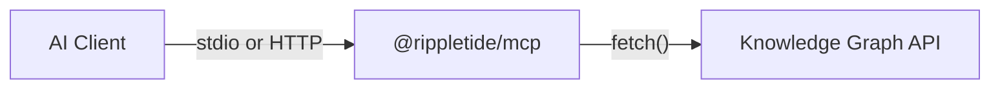

## What is the MCP Server?

The Rippletide MCP server connects AI clients (Cursor, Claude Desktop, Claude Code) to your agent's knowledge graph. It lets your AI assistant **remember**, **recall**, and **reason** over structured knowledge and across conversations to reduce unpredictability.



The MCP server acts as an intermediary, but keeps no data itself. All information is stored and managed by the knowledge graph backend.

## Quick Start

<CodeGroup>

```bash npm
npx @rippletide/mcp --api-url http://localhost:3000 --agent-id your-agent-id
```

```bash global install
npm install -g @rippletide/mcp
rippletide-mcp --api-url http://localhost:3000 --agent-id your-agent-id
```

</CodeGroup>

The server starts on **stdio mode** (default) and exposes **7 tools** and **4 resources** to your AI client. This works for local MCP clients like Cursor and Claude Desktop—**no deployment needed**.

<Note>
  **When do you need to deploy?** The stdio mode shown above is for local use. If you need to run the MCP server as a remote HTTP service, see the [Deploy guide](/docs/mcp/deploy) for instructions on using HTTP transport mode.
</Note>

## Agent ID

Each `AGENT_ID` gets its own **isolated knowledge graph**. Without it, everything goes to the `"default"` graph.

You can set the agent ID in three ways:

1. **Environment variable**: `AGENT_ID=abc-123`
2. **CLI flag**: `--agent-id abc-123`
3. **At runtime**: use the `switch_agent` tool during a conversation

<Warning>
  There is no authentication on the MCP server in V1. Anyone with the backend URL and an agent ID can read/write to that agent's graph. Authentication is planned for V2.
</Warning>

## Setup

Add to your MCP client config:

```json
{
  "mcpServers": {
    "rippletide": {
      "command": "npx",
      "args": ["-y", "@rippletide/mcp"],
      "env": {
        "GRAPH_API_URL": "http://localhost:3000",
        "AGENT_ID": "your-agent-id"
      }
    }
  }
}
```

<CardGroup cols={3}>
  <Card title="Cursor" icon="code">
    Save to `~/.cursor/mcp.json`
  </Card>
  <Card title="Claude Desktop" icon="message-bot">
    Add in Claude Desktop MCP settings
  </Card>
  <Card title="Claude Code" icon="terminal">
    Save to `.mcp.json` at your project root
  </Card>
</CardGroup>
